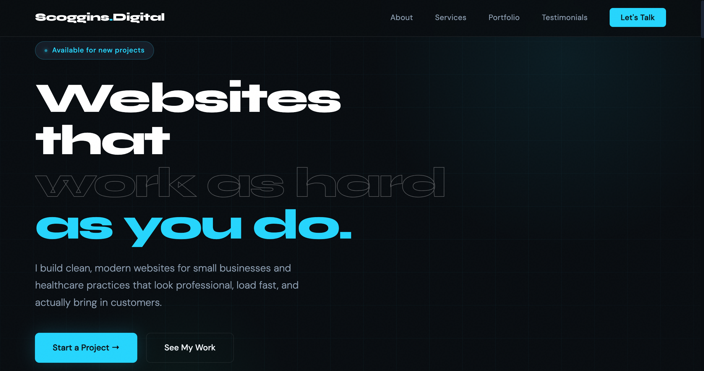

# Scoggins Digital

> Freelance web development business website — built for small businesses and healthcare practices.



---

## Overview

This is the source code for [Scoggins Digital](https://scoggins.digital), my freelance web development business. The site showcases services, portfolio work, and provides a contact form for potential clients.

Built entirely from scratch — no page builders, no templates. Clean, custom code.

---

## Tech Stack

| Layer      | Technology              |
|------------|-------------------------|
| Markup     | HTML5 (semantic)        |
| Styling    | CSS3 (custom properties, grid, flexbox) |
| Scripts    | Vanilla JavaScript (ES6+) |
| Fonts      | Google Fonts — Syne, DM Sans |
| Dev Server | VS Code Live Server     |

---

## Features

- **Fully responsive** — mobile-first layout
- **Scroll reveal animations** — IntersectionObserver-powered fade-in effects
- **Active nav highlighting** — updates on scroll
- **Contact form** — with submit feedback (ready to connect to Formspree / EmailJS)
- **Dark theme** with cyan accent and subtle noise texture overlay
- **Grid background** with radial glow effects on hero
- **Accessible** — semantic HTML, proper heading hierarchy, keyboard-navigable

---

## Project Structure

```
scoggins-digital/
├── index.html        # All markup and page structure
├── styles.css        # All styles, organized by section
├── script.js         # Scroll reveal, nav highlight, form feedback
└── screenshots/      # Portfolio thumbnails and documentation
    ├── Scoggins-Digital.png
    ├── portfolio-2026-02-2.png   # Developer Portfolio thumbnail
    ├── BC-sweets.png             # BC's Sweets & Treats thumbnail
    └── dashboard.png             # Personal Financial Tracker thumbnail
```

---

## Sections

- **Hero** — headline, available badge, CTA buttons, stats
- **About** — profile card, skill tags, background highlights
- **Services** — 6 service cards with pricing
- **Portfolio** — 3 live projects with screenshots and links:
  - [Developer Portfolio](https://hunter-scoggins-portfolio.vercel.app/)
  - [BC's Sweets & Treats](https://bc-sweets.vercel.app/)
  - [Personal Financial Tracker](https://personal-financial-tracker-frontend-production.up.railway.app/)
- **Testimonials** — client feedback cards
- **Contact** — contact methods + inquiry form
- **Social** — TikTok / LinkedIn / GitHub links

---

## Local Development

No build tools or dependencies required. Just open with a live server:

1. Clone the repo
   ```bash
   git clone https://github.com/imhunterblake/scoggins-digital.git
   ```
2. Open the folder in VS Code
3. Right-click `index.html` → **Open with Live Server**

Or simply open `index.html` directly in any browser.

---

## Deployment

This site is designed to be deployed on any static hosting platform:

- **Netlify** (recommended — free tier, easy custom domain)
- **GitHub Pages**
- **Vercel**

---

## Contact

**Hunter Scoggins**
- Email: hunter@scoggins.digital
- TikTok: [@ScogginsDigital](https://tiktok.com/@ScogginsDigital)
- LinkedIn: [linkedin.com/in/hunterscoggins](https://linkedin.com/in/hunterscoggins)

---

© 2025 Scoggins Digital. Built with ♥ in Oxford, Mississippi.